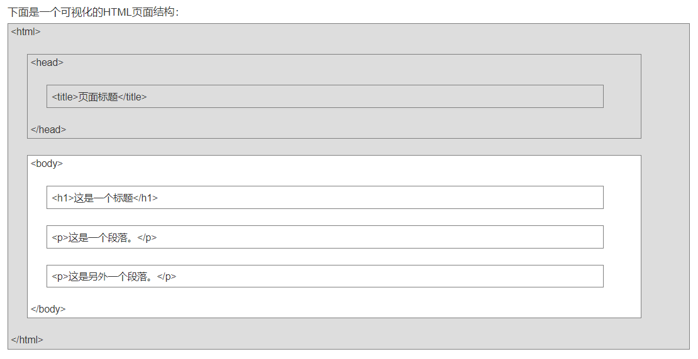

# 一、HTML

## html简介:

​	html被叫做超文本标记语言（HyperText Markup Language），是一种主要用于描述网页信息的语言。为什么叫超文本的标记语言呢？因为它比一般的文本功能更强大，不仅能编写文本，还能使用音频、视频甚至是动画等。

​	我们上网需要浏览器，而浏览器的主要工作就是将从服务器返回的源代码（.html）翻译成我们可视的生动的页面。在浏览器中，浏览器会根据html文本中的标签来展示相应的内容信息在界面上。

## html的结构:



## html实例:

```html
<!-- 定义文本类型，声明为html文件，方便浏览器正确解析该文件 -->
<!DOCTYPE html>
<html>
    <!-- 可包含基础配置（meta\noscript\base）、外部引用（style\script\link）和网页标题（title）等 -->
	<head>
        <!-- 
		让浏览器使用utf-8编码解析，保存文件时的文档编码一定要与meta设置的编码一致，否则就会出			现乱码。
		<meta>标签提供了元数据，这些数据不显示在页面，但会被浏览器解析。
		meta元素常用于指定网页的描述、关键词、文件的最后修改时间和其他元数据。
	-->
		<meta charset="UTF-8" name="key" content="小辉">
        <!-- 这样可以在标题前添加图片 -->
        <link rel="shortcut icon" href="图片url">
		<title>页面标题</title>
        <!-- 引用外部的css文件 -->
        <link rel="stylesheet" type="text/css" href="mystyle.css">
	</head>
    
    <!-- 界面可见内容都在body中-->
	<body>
		<h1>我的第一个标题</h1>
		<p>我的第一个段落。</p>
	</body>
</html>
```

## 特别笔记：


# 二、CSS

## 盒子模型：

#### 标准盒模型：

​	width = content.

#### IE盒模型：

​	with = content + padding + border.

## BFC：

#### **定位方案：**

​	定位方案是控制元素的布局，一般的布局有`普通流`、`浮动`和`绝对定位`。

#### **普通流：**

​	指一般的元素布局，如块级元素独占一行，从上至下排列，行内元素则按照水平排列，占满则换行。

#### 浮动：

​	指元素可以根据浮动的方向向左或向右偏移排列，元素脱离普通文档流，其效果与文本环绕相似。

#### 绝对定位：

​	在绝对定位布局中，元素会整体脱离普通文档流，该元素的位置有绝对定位的坐标决定。

#### BFC：

​	 块级格式化上下文，属于上述定位方案中的普通流。

​	 **使用场景：**在元素因使用浮动之类的原因而脱离文档流时，为了将脱离的元素拉回到一个容器内，我们可以选择触发该元素的BFC，使其元素在布局上不会影响到容器外的元素。

​	**如何触发：**

 - 根元素为body。
 - 浮动元素为：float：none以外的值。
 - 绝对定位元素：position（absolute、fixed）
 - display为inline-block、table-cells、flex等。
 - overflow除了visible以外的值（hidden、auto、scroll）

​	**BFC特性：**

	- 同一个BFC容器下的元素外边距会发生折叠。
	- BFC可以包含浮动的元素（也就是清除浮动）。
	- BFC可以阻止元素被浮动元素覆盖。

## 元素单位：

​	**px：**绝对单位，页面按精准像素显示。

​	**em：**相对单位，根据父节点的字体大小来计算，自身定义了font-size则按自身来计算。

​	**rem：**相对单位，根据根节点的字体大小来计算。

​	**vh、vw：**主要用于页面视口大小的布局。

# 三、JavaScript


## 数组操作：

#### 添加元素：

- **arr.push()：**可接收`任意数量的参数`到数组末尾，并返回数组最新长度。
- **arr.conscat()：**先`创建当前数组的副本`，将传入参数添加指副本数组末尾，不会影响原始数组，并返回最新的这个副本数组。

#### 删除元素：

 - **arr.pop()：**删除数组的`最后一项`，同时减少数组的`length`值，并返回被删除的项。
 - **arr.shift()：**删除数组的`第一项`，同时减少数组的`length`值，并返回被删除的项。
 - **arr.splice()：**传入2个参数，分别是删除的`开始位置`和`删除元素的数量`，并返回包含删除元素的数组。
 - **arr.slice()：**传入`两个下标值`作为范围区间，如arr.slice(1,3),并返回该区间内的值。

#### 修改元素：

 - **arr.splice()：**传入3个参数，分别为`开始位置`、`删除元素的数量`和要`添加的任意多个元素`，并返回修改后的数组。

#### 查询元素：

 - **arr.indexOf()：**传入要查找的元素，并返回要查找元素在该数组中的下标值，没找到则返回 -1。
 - **arr.includes()：**传入要查找的元素，存在则返回ture，不存在则返回false。
 - **arr.find()：**传入要查找的元素，返回第一个通过匹配（函数内判断）的元素。

#### 迭代方法：

> 不改变原数组，返回值为新数组。

 -  **arr.map()：**对数组每一项都运行传入的函数，返回由每次函数调用的结果构成的数组。
 -  **arr.filter()：**对数组的每一项都运行传入函数，函数返回`true`的项会组成新数组返回。
 -  **arr.every()：**对数组的每一项都运行传入的函数，如果每一项都返回`true`，则这个方法返回`true`。

#### 去重方法：

- **new Set(arr)：**set是一种新的数据结构，是一个类数组，返回值为去重后的数组和长度。

## 事件委托：

​	**内涵：**js的事件委托指的是利用冒泡的原理，把本应该只在某个元素上的事件委托给他的父级，从而减少DOM交互达到网页优化。

​	**优点：**减少事件注册，节省内存占用。方便实现当新增子对象时，无需对其进行事件绑定，对于动态内容又为合适。

​	**缺点：**事件委托常应用于并应该仅限于上述需求，如将所有事件都用事件委托，则会出现原本不该触发的事件被绑定上了事件的情况。

## 原型和原型链：

​	**原型：**每个对象都拥有一个原型对象

​	**原型链：**当我们试图访问一个对象的属性时，程序不仅仅会在该对象上寻找，还会搜寻该对象的原型，以及该原型的原型，依次向上搜索，直至找到一个名字匹配的属性或达到原型链的末尾，这个查找的过程形成的链条就叫原型链。

## 作用域和作用域链：

​	**作用域：**每个对象中的内容(变量和函数)的可访问范围。

​	**作用域链：**当我们试图对一个对象进行变量取值而找不到该值时，就会向上级作用域去查找，直至查到全局作用域，这个查找到过程形成的链条就叫作用域链。

## 闭包：

​	**闭包：**指一种能够读取其他函数内部变量的技术手段，其表现形式为函数里面套函数。

​	**闭包原理：**因为函数的产生会产生作用域链，所以在函数里面套函数可以帮助我们通过作用域链拿到原本不属于自己的内容。

​	**使用场景：**创建私有变量或延长变量的生命周期时。

## 防抖和节流：

​	**防抖：**事件触发只执行最后一次触发的。

​	**使用场景：**如在输入框中输入内容，等输入完毕后再向后端请求数据，不使用防抖的话会将每次输入的时候都会触发。

​	**节流：**控制事件触发的次数。

​	**使用场景：**如滑动滚动条时，可以限制滑动了一定长度或时间才触发事件，而不是一直滑动就一直触发。

## Call和Apply：

call和apply都是函数对象的方法，主要作用是执行函数，但是可以通过传递参数的形式改变this的指向。	

**区别：**call传递的参数为aru1,aru2的方式，apply必须是数组形式[aru].

**用法：**

```js
fn.call(obj,aru1,aru2);
fn.apply(obj,[aru])
```

## 深拷贝和浅拷贝：

浅拷贝指一个值的修改会影响另一个值。

深拷贝是指一个值的修改不会影响到另一个指。

其原理就在数据在内存中引用地址的改变。

## 本地储存：

​	以前网站只是负责展示界面，不用记录用户信息，但随着业务的扩展，比如一些商城网站，需要根据用户信息来获取 属于他们的某些特别的数据，这是就面临一个问题，那就是要管理会话，需要知道哪些人登陆了系统，哪些人给购物车添加了商品。

​	第一阶段：给大家发一个会话标识（session id），用户第一次登录系统时，系统给这个用户相应且独有的session id,这样用户每次发送请求时就可以把这个seesion id和用户信息一并捎过来，进而却分谁是谁了。

​	缺点：用户只需要保存自己的session id，而服务器需要保存各个用户的session id，限制了服务器的扩展能力，而且这个session id是保存在用户登录的机器上，用户用另一台机器是就没有session id了，后面想到将原有的sessionid进行迁移，可这搬来搬去的是很费劲的。

​	第二阶段：只让客户端进行保存就好。而为了验证对方是不是非法登录的用户，我们可以给用户发一个令牌（token），里面包含了用户的 user id，并且对该数据进行了数字签名，加上只有服务器这边才知道的密钥，这样就算别的用户获得了token，没有密钥那他就无法伪造token了，之后用户每次访问的时候，只需要将这个token发过来，服务器再使用密钥再对数据进行签名，通过对比token中的签名，就获取user id，如不相同，则不通过认证。这样一来服务器只需要做验证的工作，而不用保存这些token或是session id了。

​	总结：

​	第一阶段是客户端和服务器端都需要保存对应的session id，来管理会话信息。

​	第二阶段则是客户端单方面保存对应的token，服务器只需要通过 对token进行验证即可。

#### cookie:

​	一种客户端保存用户信息的网络机制，用来记录用户的一些信息，也是实现session的一种方式。

​	cookie的机制：

​	当用户第一次访问并登录一个网站时，cookie的设置以及发送过程如下：

​	1、客户端发送请求到服务器。

​	2、服务器发送HttpResponse响应到客户端，其中包含Set-Cookie的头部。

​	3、客户端保存cookie，再向服务器发送请求时，HttpResponse请求会包含cookie的头部。

​	4、服务器返回数据。

#### sessionStorage:

​	服务器为每个用户浏览器创建一个会话对象，默认情况下一个浏览器独占一个session对象。因此，在一个浏览器内，用户的session数据是可以在各个网站共用的。

#### localStorage:

#### 区别：

- 存储大小：cookie数据不能超过4K，但其他两个可以达到5M或以上。

- 有效时间：

​		1、由`cookie`设置的过期时间决定，即使窗口或浏览器关闭。

​		2、`localStorage`存储持久数据，浏览器关闭后也不会丢失，除非主动删除数据。

​		3、`sessionStorage`数据在当前浏览器关闭后自动删除。

- 交互方式：

​		1、`cookie`的数据会自动传递到服务器，服务端也可以写`cookie`到客户端。

​		2、`sessiongStorage`和`localStorage`不会发给服务器，仅保存在本地。

#### 应用场景：

- 标记用户与跟踪用户行为的情况，推荐使用`cookie`。
- 适合长期保存在本地的数据（令牌），推荐使用`localStorage`。
- 敏感账号一次性登录，推荐使用`sessionStorage`。
- 存在跨域问题建议使用`token`。

## 构造函数：

#### 构造函数是什么？

​	构造函数就是一个函数。

#### 构造函数与普通函数的区别：

​	**1、调用方式不一样：**

```js
//普通函数调用：
fn();
//构造函数调用：
new Fn();
```

​	**2、作用不一样：**构造函数用来新建实例对象，而普通函数是为了封装执行代码。


#### 构造函数的优缺点：

- **优点：**构造函数创建的属性和方法可以在实例之间共享。
- **缺点：**如果实例之间有相同的方法，那么该方法会在每个实例上都创建一遍，造成资源浪费。

# 四、ES6

## 解构赋值：

​	**概念：**ES6允许按照一定模式从数组和对象中提取值，对变量进行赋值，这被称为解构赋值。

​	**用途：**

#### 数组的解构：

```js
// 按顺序解构多项
[a,b,...] = [10, 20, 30];
console.log(a);
// expected output: Array [10]

// 指定解构某一项
[a=30,,...] =  [10, 20, 30];
console.log(a);
// expected output: Array [30]

// 
[a, b, ...rest] =  [10, 20, 30，40];
console.log(rest);
// expected output: Array [30,40]
```

#### 	对象的解构：

```js
let { foo, bar } = { foo: 'aaa', bar: 'bbb' };
console.log(foo);
// expected output: 'aaa'
 
let { bar : foo } = { bar : 'ddd' };
console.log(foo);
// expected output: 'ddd'
```

#### 	模块的解构：

```js
   //解构赋值形式：
    improt {e,f} from "模块文件路径";
    improt {e as e1} from "模块文件路径";
    improt {defualt as e2} from "模块文件路径";
```

## 箭头函数

​	**声明函数：**let fn = (a,b) =>{ return a+b; }

​	**调用函数：**let result = fn(1,2);

​	**特点：**

​	1、this是静态的，意思是说this始终指向函数声明时所在作用域下的this,而普通函数则是谁调用就指向谁。

​	2、不能作为构造器实例化对象。

​	3、不能使用arguments变量。

​	4、箭头函数的简写：

​		1）、当形参有且只有一个的时候，可省略小括号。

​		2）、当代码体只有将一条语句时，此时可省略花括号和return，且语句的执行结果就是函数的返回值。

**总结：**箭头函数适合与this无关的回调，如定时器、数组的方法回调。

​			箭头函数不适合与this有关的回调，如事件回调、对象的方法等。

## Promise:

> Promise是一种针对异步编程的解决方案。

#### Promise简述：

创建Promise实例：

```js
var promise = new Promise(function(resolve, reject){
    // ... some code
    if (/* 异步操作成功 */) {
        resolve(value);
    } else {
        reject(error);
    }
})
```

基本用法示例：

```js
function sleep(ms) {
    return new Promise(function(resolve, reject) {
        setTimeout(resolve, ms);
    })
}
//此时sleep是一个promise对象，通过.then方法可以传递一个函数，回调resolve函数。
sleep(500).then(()=> console.log("finished"));
```

#### async和await：

​	**async：**async命令指向的函数必定返回一个Promise对象。

​	**await：**正常情况下await命令后是一个 Promise对象，并在等待异步操作执行完后返回该对象的结果。如果不是Promise对象，则直接返回对应的值。

```js
function sleep(ms) {
    return new Promise(function(resolve, reject) {
        setTimeout(resolve,ms);
    })
}
async function handle(){
    console.log("AAA")
    await sleep(5000)
    console.log("BBB")
}
handle();
//输出结果：
// AAA
// BBB (5000ms后)
```

## Ajax：

- `ajax`是一种网络请求获取数据的技术，该技术包含了get和post请求，但它不能直接实现跨域。

- `axios`是通过promise实现对ajax技术的一种封装，axios是ajax，但ajax不止axios。

#### get和post的区别：

- get请求不安全，get的请求参数会在url中显示，post请求安全，post的请求参数在请求体中，并且会对服务器发送两次请求，第一次为询问，第二次才是正式发送数据。
- get请求数据有大小限制，post无限制。
- post请求需要设置请求头。

## Axios:

​	axios是一个基于promise网络请求库，其本质 上是ajax的封装结果。

​	axios实例：

```js
// 导入axios对象
import axios from 'axios'

// 创建axios实例
async getRes(){
    // 可以通过axios对象的defaults属性设置基础配置
    axios.defaults.baseURL = 'https//baidu.com'
    // 使用别名
    let res = await axios.get('/user',config)
    // 使用API
    let res =  await axios({
        methods:'get',
        url:'/user',
        parms:{}
    })
}

```

### 	

# 五、Vue

## 浏览器的运行机制：

- 创建DOM树，创建文档对象。
- 构建渲染树，进行CSS渲染。
- 布局渲染。
- 绘制渲染树并画出来（改变外观 -- 尺寸、布局）
  - 重绘：等属性发生改变时改变元素的外观属性，如：color。
  - 重排（回流）：元素的规模尺寸、布局、隐藏改变时。
  - 代价：耗时，导致浏览器卡慢。

## 真实DOM与虚拟DOM：

​	**真实DOM：**指文档对象模型，是javascript操作html的接口。

​	**虚拟DOM：**指以javascript对象作为基础的树，用对象的属性来描述节点并且该对象最少包含标签名、书信那属性和子元素对象三个属性。最终通过一系列操作使这颗树映射到真实环境上。

​	diff算法：Vue中将DOM-diff过程叫做patch过程，即对VNode进行补丁，打补丁后得到新的VNode,再将其渲染到虚拟节点上。简单来说，就是以新的VNode为基准，改造旧的Node使之成为和新VNode一样。

## 为什么会使用虚拟DOM：

- 创建成本低。
- 通过diff算法对产生差异的节点集中修改，减少浏览器的重绘及回流，达到性能优化的效果。
- 其本质时一个js对象，因此具有跨平台的能力。
- 帮助Vue具备现代框架应有的高级特性。

#### Vue组件中的data为什么必须是函数？

​	这是js的特性所导致的，在compments中必须是函数，不能是对象。

​	而且这样设计也有一个好处：由于data是一个函数，其返回值是一个数据对象，每个对象都会有独属于自己的内存空间，这样一来就相当于每个组件实例的数据都是相互独立的，数据不易被污染。

## 设计模式：

#### MVC模式：

- **Model（数据模型）** - 指一个存取数据的对象模型。
- **View （视图）**- 指数据可视化的视图。
- **Controller（控制器）**- 控制器作用于模型和试图上。他控制数据流向模型对象，并在数据变化时更新视图。

#### MVVM模式：

- **Model（数据模型）**- 指存取数据的对象模型。
- **View（视图）** - 指数据可视化的视图。
- **View-Model（数据的双向绑定）** -  它是连接视图和数据模型的桥梁，它主要做两个工作：`数据绑定`和`DOM事件监听`。
  - **数据绑定：**即将后端数据显示到界面上。
  - **DOM事件监听：**即将界面操作结果转为后端数据。

## 组件通信：

```js
  var Event=new Vue();
   Event.$emit(事件名,数据);
   Event.$on(事件名,data => {});
// 假设兄弟组件有三个，分别是A、B、C组件，C组件如何获取A或者B组件的数据
// 组件A、B通过Event.$emit(事件名,数据)将数据传递，组件C通过 Event.$on(事件名,data => {})接受组件A、B传递的数据

```

#### 	父向子传值：

- 在父组件中定制属性，通过属性值来发送。
- 在子组件中用属性props接收。

```vue
<template>
    <div class="parent-box">
        <div>
            <div>我是父组件</div>
            <div>{{message}}</div>
        </div>
        <children :message="toChildrenMsg"></children>
    </div>
</template>
  
<script>
import Children from './Children.vue'  //当前页引入子组件
export default {
    name:"Parent",
    components:{
        Children
    },
    data(){
        return {
            message:'我是父页面的内容',
            toChildrenMsg:'从父页面传过到子页面的内容'
        }
    }
}
</script>
```

```vue
<template>
    <div class="children-box">
        <div>
            <div>我是子组件</div>
            <div>{{message}}</div>
        </div>
    </div>
</template>
  
<script>
export default {
    name:"Children",
    props:{
        //此处的message是父组件中设置的属性名。
        message:{
            type:String,  //类型判断
            default:''    //默认值
        }
    }
}
</script>
```

#### 子对父传值：

- 子组件通过this.$emit发射器将数据发送出去。
- 父组件通过监听this.$emit发射器的发送内容来定义响应函数接收。

```vue
<template>
    <div class="children-box">
        <div>
            <div>我是子组件</div>
            <div>{{message}}</div>
            <div><span @click="toParentMethod">点击触发父页面事件</span></div>
        </div>
    </div>
</template>
  
<script>
export default {
    name:"Children",
    props:{
        message:{
            type:String,
            default:''
        }
    },
    methods:{
        toParentMethod(){
            this.$emit('fromChildMethod')
        }
    }
}
</script>
```

```vue
<template>
    <div class="parent-box">
        <div>
            <div>我是父组件</div>
            <div style="font-size:12px;">{{message}}</div>
            <div style="font-size:12px;color:red">{{fromChildMsg}}</div>
        </div>
        <children :message="toChildrenMsg" @fromChildMethod="fromChild"></children>
    </div>
</template>
  
<script>
import Children from './Children.vue'
export default {
    name:"Parent",
    components:{
        Children
    },
    data(){
        return {
            message:'我是父页面的内容',
            toChildrenMsg:'从父页面传过到子页面的内容',
            fromChildMsg:''
        }
    },
    methods:{
        fromChild(){
            this.fromChildMsg = '子页面触发的方法' //监听到子组件触发的方法，显示该内容
        }
    }
}
</script>
```

#### 兄弟之间传值：

​	**步骤：**

- 创建一个vue对象实例作为总线。
- this.bus.$emit(name，prams)用来发射数据。
- this.bus.$on(name，prams)用来接收数据。

```vue
<div id="itany">
	<my-a></my-a>
	<my-b></my-b>
	<my-c></my-c>
</div>
<template id="a">
  <div>
    <h3>A组件：{{name}}</h3>
    <button @click="send">将数据发送给C组件</button>
  </div>
</template>
<template id="b">
  <div>
    <h3>B组件：{{age}}</h3>
    <button @click="send">将数组发送给C组件</button>
  </div>
</template>
<template id="c">
  <div>
    <h3>C组件：{{name}}，{{age}}</h3>
  </div>
</template>
<script>
var Event = new Vue();//定义一个空的Vue实例
var A = {
	template: '#a',
	data() {
	  return {
	    name: 'tom'
	  }
	},
	methods: {
	  send() {
	    Event.$emit('data-a', this.name);
	  }
	}
}
var B = {
	template: '#b',
	data() {
	  return {
	    age: 20
	  }
	},
	methods: {
	  send() {
	    Event.$emit('data-b', this.age);
	  }
	}
}
var C = {
	template: '#c',
	data() {
	  return {
	    name: '',
	    age: ""
	  }
	},
	mounted() {//在模板编译完成后执行
	 Event.$on('data-a',name => {
	     this.name = name;//箭头函数内部不会产生新的this，这边如果不用=>,this指代Event
	 })
	 Event.$on('data-b',age => {
	     this.age = age;
	 })
	}
}
var vm = new Vue({
	el: '#itany',
	components: {
	  'my-a': A,
	  'my-b': B,
	  'my-c': C
	}
});	
</script>
```


## VUEX：

#### stroe：

​	状态管理

#### getter:

​	获取状态信息并美化状态信息，类似于计算属性。

#### moutation:

​	处理状态信息。这里的函数必须是同步的，异步操作会导致其状态不可被追踪，因为不知道回调函数什么时候执行。

#### action：

​	异步请求在这里执行，通过commit（）将结果提交给moutation，再由moutation进行处理。

#### 例子：

```js
import {
  createStore
} from 'vuex'

export default createStore({
  // 公共属性
  state: {
    goods: {
      name: "123",
      imgUrl: "55",
      price: "66",
    }
  },
  // 计算属性
  getters: {
    // 获取公共属性
    getGoods: (state) => {
      return state.goods + 2;
    }
  },
  // 改变属性值的逻辑应该在此处理
  mutations: {
    setGoods: (state, param) => {
      return state.goods.name = param;
    }
  },
  // 异步操作，再由commit提交给mutation
  actions: {
    acSetGoods(context, name) {
      setTimeout(() => {
        context.commit("setGoods", name)
      }, 1000);
    }
  },
  modules: {}
})
```

