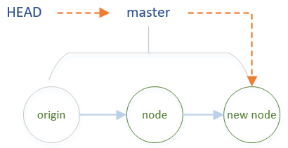
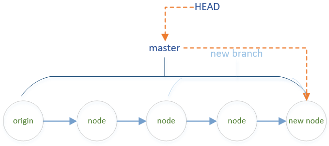

# GitHub
## 什么是GitHub?

​	github是一个分布式的版本控制系统。其主要作用就是通过跟踪管理文件修改的版本，帮助我们能够相对准确的追溯我们想要找到的的版本文件。

## 文件的存放区域：

- **工作区：**也就是本地操作的文件目录。

- **版本库：**工作区内可以生成一个.git目录，这是git的`版本库`。
  - **暂存区：**版本库中有块存储state的区域就叫暂存区。

  - **分支：**创建Git版本库时，Git自动为我们创建了唯一一个`master`分支，对代码进行的版本控制操作都是在一个分支里进行的。

- **远程仓库：**一般为自己创建的github仓库，可以被多个客户端进行连接。

### 文件的提交过程：


​	第一步：对文件进行修改。	

​	第二步：通过`git add .`把文件从`工作区`添加至`暂存区`。

​	第三步：通过`git commit`将`暂存区`的代码提交至`分支`，为了使其更具有意义，提交指令一般写为：`git commit -m "对这个操作的描述"`。

​	第四步：通过`git push`将`分支`的代码上传到`远程仓库`上。

## 本地操作

### 查看文件：

​	查看当前文件状态：

```css
$ git status
```

​	提交后到缓存区后，查看工作区与版本库中文件的区别：

```css
$ git diff HEAD -- file.txt
```

### 将文件添加到暂存区(.gitinore目录)：

​	添加到state:

```css
$ git add .
```

​	提交到分支:

```css
$ git commit -m "对操作的描述"
```

### 撤销对文件修改：

​	将文件在工作区的修改全部撤销：

```css
$ git checkout -- file.txt  可使用代替：git restore -- file.txt
```

​	撤销暂存区的修改，回退给工作区（相当于从暂存区恢复）：

```css
$ git reset HEAD file.txt  可使用代替：git restore --staged file.txt
```

​	文件commit后撤销：

```css
$ git reset --hard HEAD^回退版本id
```

​	**Tips⭐：**

>1、`git checkout`撤销修改会出现以下两种情况：
>
>	- **添加到暂存区时：**回到添加到暂存区后的状态（工作区中的文件状态）。
>	- **未添加到暂存区时：**回到和版本库一摸一样的状态（暂存区中的文件状态）。
>
>2、`git checkout -- file`命令中的`--`很重要，没有`--`，就变成了“切换到另一个分支“的指令。
>
>3、`git checkout`其实是用版本库里的版本替换工作区的版本，无论工作区是修改还是删除，都可以“一键还原”。
>
>4、`git reset`命令既可以回退版本，也可以将`暂存区`的修改回退到`工作区`，当使用`HEAD`时表示最新版本。

### 删除文件：

​	从版本库中删除该文件：

```css
$ git rm file.txt
```

```css
$ git commit - m "对这个操作的描述"
```

​	**Tips⭐：**

> `git rm`用于删除一个文件。如果一个文件已经被提交到版本库，那么你永远不用担心误删，但是要小心，你只能恢复文件到最新版本，你会丢失**最近一次提交后你修改的内容**。
>
> **⚠️注意：**从来没有被添加到版本库就被删除的文件，是无法恢复的！

## 远程仓库操作

### 关联远程仓库：

​	关联远程仓库：

```css
$ git remote add origin git@github.com:shinichi-github-xh/vuePress-demo.git
```

​	**Tips⭐：**

> 1、`origin`作为远程仓库名称，Git默认叫法就是`origin`。
>
> 2、指令后面的链接是github提供的仓库链接。
>
> 3、`https`协议速度慢，每次推送还需要输入口令。`ssh`协议速度最快，但某些开放`https`端口的公司内部就无法使用`ssh`协议而只能使用`https`

### 向远程仓库推送内容：

​	首次将分支内容推送到远程仓库：

```css
$ git push -u origin master
```

​	**Tips⭐：**

> 1、`master`是当前要推送的分支名称。
>
> 2、由于远程仓库是空的，所以首次推送分支时，需要添加`-u`参数。
>
> 3、执行后该分支会被推送到远程仓库，并且将远程仓库和本地的分支进行关联，后续对该分支的推送或拉取就可以简化命令。如推送指令改成：`git push origin master`

### 查看远程仓库信息：

​	查看远程仓库：

```css
$ git remote -v
```

### 解除远程仓库关联：

​	根据仓库名称删除：

```css
$ git remote rm origin
```

​	**Tips⭐：**

> 此处的“删除”其实是解除了本地和远程的绑定关系，并不是物理上删除了远程库。远程库本身并没有任何改动。要真正删除远程库，需要登录到GitHub，在后台页面找到删除按钮再删除。

### 克隆仓库：

> 以上操作都是在先有本地仓库后创建远程仓库的情况下，下面将从先有远程仓库后有本地仓库的情况进行操作。

​	将远程仓库克隆到本地：

```css
$ git clone git@github.com:shinichi-github-xh/vuePress-demo.git
```

## 分支管理

### 什么是分支：

​	分支就是一条Git通过提交节点组成的时间线，每提交一次文件就会产生一个新的分支节点。

### 主分支和次分支：

​	对每次提交的节点，Git会将它们串成一条时间线，这条时间线就是分支。默认分支为`master`分支，也就是说，如果你不进行更改的话，`master`分支会作为`当前分支`来使用。

​	`当前分支`会指向最新的提交节点，然后会有一个`HEAD`指针指向`当前分支`，每次提交，分支节点都会向前增加一个新节点，随着不断的提交，分支的线也就越来越长。

​	为了提高开发效率和安全性，Git官方鼓励我们大量使用分支功能。



​	当创建新分支时，Git会创建一个新的指针指向与`master`分支指向相同的节点，并且随后对文件的操作都将在新分支上进行，不会对`master`分支产生作用。


​	当新分支的功能开发完毕后，可以选择与主分支进行合并，更新仓库的文件版本，如图所示，合并完成后，`master`分支就是最终版本了。



### 创建分支：

​    创建分支指令：

```css
$ git branch <branchName>
```

### 查看分支：

​	查看分支信息指令：

```css
$ git branch
```

### 切换分支：

​	将已有的分支切换为`当前分支`指令：

```css
/* 旧版操作 */
$ git checkout <branchName>  

/* 新版操作(建议使用) */
$ git switch <branchName>
```

​	创建并切换为`当前分支`：

```css
/* 旧版操作 */
$ git checkout -b <branchName>  

/* 新版操作(建议使用) */
$ git switch -c <branchName>
```

### 合并分支：

​	将`某分支`合并到`当前分支`指令：

```css
$ git merge <branchName>
```

### 删除分支：

​	删除分支指令：

```css
$ git branch -d <branchName>
```

